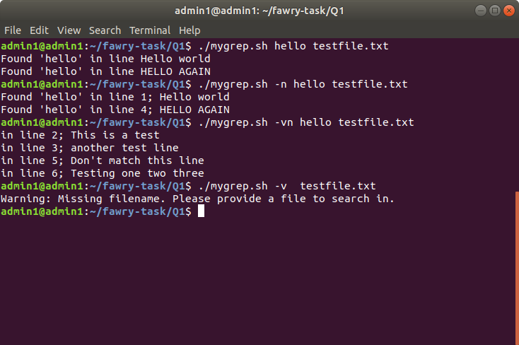

# mygrep.sh

This script implements a custom version of the `grep` command to search for a word in a specified file. 

## Usage

## Syntax

./custom-grep.sh [options] <word-to-check> <filename>

Options
-n: Display the line number along with the line when the word is found.

-v: Invert the match to display lines that do not contain the word.

-nv or -vn: Combination of -n and -v to display the line number and exclude lines containing the word.

--help To be added 

## Example
./custom-grep.sh -nv critical log.txt

## Script breakdown

Argument Parsing:
The script checks if the first argument is a flag (-n, -v, or -nv/-vn). It sets flags displayline and invertwords accordingly.
If no valid flags are provided, it proceeds without modifying the search behavior.

Argument Validation:
The script verifies that both the search string (wordtocheck) and the filename (filename) are provided. If either is missing, it exits with a warning.

Search Logic:
The script processes the file line by line:

If invertwords=false, it checks if the line contains the search string (case-insensitive). If a match is found, it outputs the line, including the line number if displayline=true.
If invertwords=true, it checks for lines that do not contain the search string and outputs them similarly.

Output:
Depending on the flags (-n and -v), the script outputs lines either matching or excluding the search string, with optional line numbers.

## Additional regex support

To support additional options:

-i: Add a flag to perform case-insensitive matching without manually converting strings to lowercase.

-c: Add a counter to count the number of matching lines and print the total at the end.

-l: If any match is found, print only the filename and stop processing further lines.

## Regex, -i, -c, -l support

To support regex, `-i`, `-c`, and `-l` options, I would expand the argument parsing to detect these flags and set appropriate control variables. For regex, I would treat the pattern as a regular expression if specified, using `[[ "$line" =~ $pattern ]]` for matching. The `-i` flag would apply case-insensitive matching, only converting text to lowercase if `-i` is set. The `-c` flag would count the number of matches and output the total, while `-l` would modify the script to loop through multiple files and print only the filenames of those containing matches, rather than the matching lines. The main loop and search logic would adjust dynamically based on these flags.

## Testing Results

## Hardest part
The hardest part to implement in code was dealing with the interaction of flags like -n, -v, and -nv and offering flexibility in argument parsing. It needed proper validation and handling of how each flag interacted with others, particularly because some flags change the output format while others change the match logic. Ensuring the script could handle all combinations without any errors while offering clear logic for different search behaviors made this section difficult.