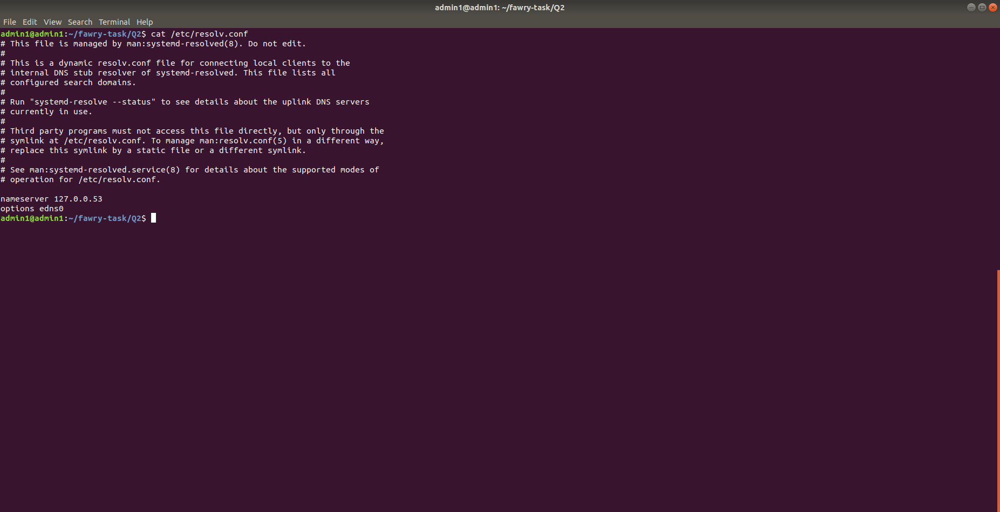
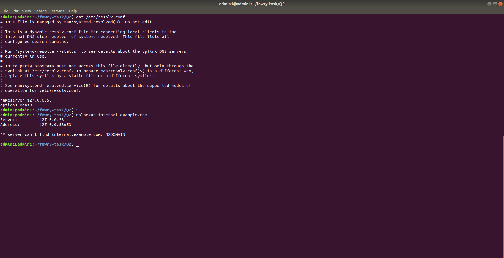
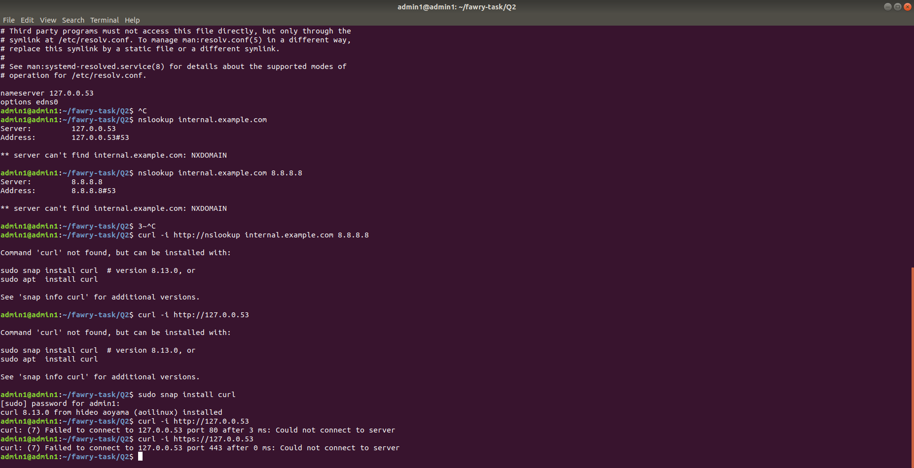
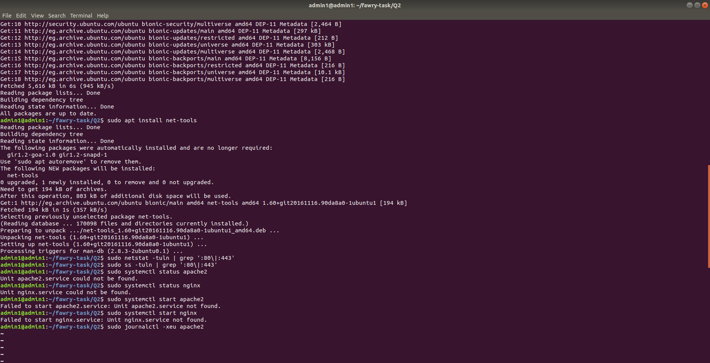

# Q2 Scenario Troubleshooting

as mentioned in the task, I will verify DNS resolution, by using cat /etc/resolv.conf we get to know our nameserver which is 127.0.0.53
next step is to  try and reselove internal.example.com by using the configured DNS: by running the command we see that ** server can't find internal.example.com: NXDOMAIN.

it failed which means that the problem is in the internal DNS config, to resolve: we try and use Google dns server, we get the same error which means both methods failed leading to a web server issue

next step is to use the curl tool for ports 80 or 443, both failed which might indicate that a firewall is blocking access.

we check if the service is listening on the correct ports by running sudo netstat -tuln | grep ':80\|:443'
it gave no output which means that there is no active service that is listening on the ports, which indicates that it is a web server or service problem

If there is a running web server or service while internal.example.com is down these are the following steps i would take:- 

1- Diagnose Service Reachability
    Commands used:
ping <server-ip>
nc -zv <server-ip> 80
nc -zv <server-ip> 443
curl http://<server-ip>
- Direct connection to server ip address on ports 80 and 443 is successful
- ping and curl responses also successful

2- Verify service locally
    command used:
    curl http://localhost
- if i get a page back then its running fine on localhost

## Now to list the possible causes:

1- DNS: 
- Missing or incorrect DNS record
- Wrong DNS server configuration
- Stale DNS cache on client/server
- Missing /etc/hosts entry

2- Network: 
- None since IP is reachable

3- Service:
- None service is running fine and responsive

## Possible fixes: 
- DNS issues:

- Missing DNS record
 dig internal.example.com
Cause: If no A record returned ⇒ problem confirmed.
to fix: update DNS server by adding: internal.example.com. IN A 192.168.x.x

- Wrong DNS server
cat /etc/resolv.conf
Cause:If external DNS (e.g., 8.8.8.8) is set instead of internal DNS.
to fix: Update nameserver to point to internal DNS (nameserver 192.168.1.1)

- Stale DNS cache	
Cause: If correct record is added but system still can't resolve.
to fix: sudo systemd-resolve --flush-caches

## Summary of Commands Used:

# Confirm Service
- sudo systemctl status nginx
- sudo systemctl status apache2
- sudo ss -tuln

# DNS Checks
- nslookup internal.example.com
- dig internal.example.com
- nslookup internal.example.com 8.8.8.8
- cat /etc/resolv.conf
- cat /etc/hosts
- sudo systemd-resolve --flush-caches

# Network Checks
- ping 127.0.0.53
- nc -zv 127.0.0.53 80
- nc -zv 127.0.0.53 443
- curl http://127.0.0.53

